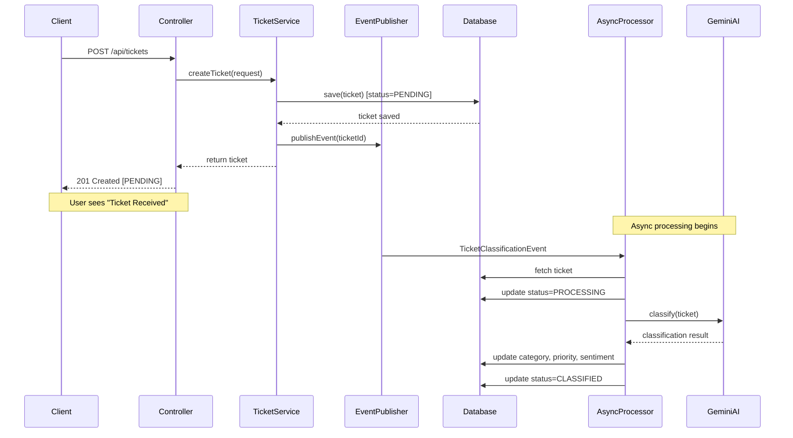

# Architecture Overview

This document explains the system architecture, components, and how they work together to create an event-driven ticket triage system.

## System Architecture

```mermaid
graph TB
    subgraph "Client Layer"
        A[REST Client]
    end
    
    subgraph "API Layer"
        B[TicketController]
    end
    
    subgraph "Service Layer"
        C[TicketService<br/>PRODUCER]
        D[AsyncTicketProcessor<br/>CONSUMER]
        E[GeminiClassificationService]
    end
    
    subgraph "Event System"
        F[ApplicationEventPublisher]
        G[TicketClassificationEvent]
    end
    
    subgraph "Data Layer"
        H[TicketRepository]
        I[(H2 Database)]
    end
    
    subgraph "External Services"
        J[Google Gemini AI]
    end
    
    A -->|POST /api/tickets| B
    B --> C
    C -->|Save ticket| H
    H --> I
    C -->|Publish event| F
    F -->|TicketClassificationEvent| G
    G -->|@EventListener| D
    D -->|Fetch ticket| H
    D -->|Classify| E
    E -->|API call| J
    J -->|Classification result| E
    E -->|Return result| D
    D -->|Update ticket| H
```

## Component Responsibilities

### 1. REST API Layer

#### `TicketController`
**Location**: `com.tickettriage.controller.TicketController`

**Responsibilities**:
- Exposes REST endpoints for ticket operations
- Validates incoming requests
- Converts between DTOs and domain models
- Returns appropriate HTTP responses

**Key Endpoints**:
```java
POST   /api/tickets          // Submit new ticket
GET    /api/tickets/{id}     // Get ticket by ID
GET    /api/tickets          // List all tickets (with filters)
GET    /api/tickets/stats    // Get statistics
```

### 2. Service Layer

#### `TicketService` (PRODUCER)
**Location**: `com.tickettriage.service.TicketService`

**Responsibilities**:
- Business logic for ticket management
- Creates tickets with PENDING status
- **Publishes events** for async processing
- Provides query methods

**Producer Pattern**:
```java
@Transactional
public Ticket createTicket(TicketRequest request) {
    // 1. Save ticket
    Ticket ticket = ticketRepository.save(ticket);
    
    // 2. PUBLISH EVENT (non-blocking)
    eventPublisher.publishEvent(
        new TicketClassificationEvent(this, ticket.getId())
    );
    
    // 3. Return immediately
    return ticket;
}
```

#### `AsyncTicketProcessor` (CONSUMER)
**Location**: `com.tickettriage.service.AsyncTicketProcessor`

**Responsibilities**:
- **Listens for classification events**
- Processes tickets asynchronously
- Calls Gemini AI service
- Updates ticket with classification results
- Handles errors gracefully

**Consumer Pattern**:
```java
@Async("ticketProcessorExecutor")
@EventListener
@Transactional
public void handleTicketClassification(TicketClassificationEvent event) {
    // 1. Fetch ticket
    // 2. Update status to PROCESSING
    // 3. Call Gemini AI
    // 4. Update ticket with results
    // 5. Set status to CLASSIFIED
}
```

#### `GeminiClassificationService`
**Location**: `com.tickettriage.service.GeminiClassificationService`

**Responsibilities**:
- Integrates with Google Gemini API
- Constructs classification prompts
- Parses AI responses
- Extracts category, priority, and sentiment

**AI Prompt Structure**:
```
Analyze the following customer support ticket:

Subject: {subject}
Description: {description}

Classify with:
1. Category: [BILLING, TECH_SUPPORT, BUG, FEATURE_REQUEST, GENERAL]
2. Priority: [LOW, MEDIUM, HIGH, URGENT]
3. Sentiment: 1-10 scale

Respond in format:
CATEGORY: <category>
PRIORITY: <priority>
SENTIMENT: <number>
REASONING: <explanation>
```

### 3. Event System

#### `TicketClassificationEvent`
**Location**: `com.tickettriage.event.TicketClassificationEvent`

**Responsibilities**:
- Carries ticket ID for processing
- Extends Spring's `ApplicationEvent`
- Enables decoupling between producer and consumer

#### `ApplicationEventPublisher`
**Built-in Spring Component**

**Responsibilities**:
- In-memory event broker
- Routes events to listeners
- Manages event lifecycle

### 4. Configuration

#### `AsyncConfig`
**Location**: `com.tickettriage.config.AsyncConfig`

**Responsibilities**:
- Configures thread pool for async processing
- Defines executor settings

**Thread Pool Configuration**:
```java
Core Pool Size: 10 threads
Max Pool Size: 50 threads
Queue Capacity: 100 tasks
Thread Name Prefix: "ticket-processor-"
```

### 5. Data Layer

#### `TicketRepository`
**Location**: `com.tickettriage.repository.TicketRepository`

**Responsibilities**:
- Data access operations
- Custom queries for filtering
- Count operations for statistics

#### `Ticket` Entity
**Location**: `com.tickettriage.model.Ticket`

**Database Schema**:
```sql
CREATE TABLE tickets (
    id BIGINT PRIMARY KEY AUTO_INCREMENT,
    subject VARCHAR(500) NOT NULL,
    description VARCHAR(5000) NOT NULL,
    status VARCHAR(20) NOT NULL,
    category VARCHAR(50),
    priority VARCHAR(20),
    sentiment INTEGER,
    created_at TIMESTAMP NOT NULL,
    updated_at TIMESTAMP,
    error_message VARCHAR(1000)
);
```

**Enums**:
- `TicketStatus`: PENDING, PROCESSING, CLASSIFIED, FAILED
- `Category`: BILLING, TECH_SUPPORT, BUG, FEATURE_REQUEST, GENERAL
- `Priority`: LOW, MEDIUM, HIGH, URGENT

## Workflow: Ticket Submission to Classification

### Step-by-Step Flow



### Detailed Steps

1. **Client Submits Ticket** (0ms)
   - POST request to `/api/tickets`
   - Payload: subject + description

2. **Controller Validates** (1ms)
   - Validates request using `@Valid`
   - Converts DTO to domain model

3. **Service Creates Ticket** (5ms)
   - Saves ticket with `PENDING` status
   - Publishes `TicketClassificationEvent`
   - Returns immediately

4. **Client Receives Response** (10ms)
   - HTTP 201 Created
   - Ticket with `PENDING` status
   - User sees "Ticket Received"

5. **Async Processing Begins** (background)
   - Event listener picks up event
   - Runs in separate thread from pool

6. **Status Update to PROCESSING** (50ms)
   - Ticket status updated in database
   - Indicates classification in progress

7. **Gemini AI Classification** (1-3 seconds)
   - Sends ticket to Gemini API
   - Receives classification response
   - Parses category, priority, sentiment

8. **Ticket Updated** (3.1 seconds)
   - Category, priority, sentiment saved
   - Status changed to `CLASSIFIED`

9. **Client Polls for Updates** (optional)
   - GET `/api/tickets/{id}`
   - Sees updated classification

## Event-Driven Architecture Benefits

### 1. **Non-Blocking Operations**
- API returns immediately
- User doesn't wait for AI processing
- Better user experience

### 2. **Decoupling**
- Producer doesn't know about consumer
- Easy to add more event listeners
- Flexible architecture

### 3. **Scalability**
- Thread pool handles concurrent requests
- Can process multiple tickets simultaneously
- Configurable pool size

### 4. **Resilience**
- Failed classifications don't crash the API
- Errors are logged and tracked
- Tickets marked as `FAILED` for retry

### 5. **Observability**
- Clear separation of concerns
- Easy to log each step
- Simple to add monitoring

## Comparison: Spring Events vs Kafka

| Aspect | Spring Events | Kafka |
|--------|---------------|-------|
| **Setup** | Zero config | Requires broker setup |
| **Scope** | Single JVM | Distributed system |
| **Persistence** | In-memory only | Persistent on disk |
| **Delivery** | Best effort | Guaranteed delivery |
| **Scalability** | Thread pool | Horizontal scaling |
| **Use Case** | Development, small apps | Production, microservices |

## Performance Considerations

### Thread Pool Sizing

**Current Configuration**:
- Core: 10 threads
- Max: 50 threads
- Queue: 100 tasks

**Recommendations**:
- **Low traffic** (< 100 tickets/hour): Default settings
- **Medium traffic** (100-1000 tickets/hour): Core=20, Max=100
- **High traffic** (> 1000 tickets/hour): Consider Kafka

### Database Optimization

**Indexes** (automatically created):
- Primary key on `id`
- Index on `status` for filtering
- Index on `category` for statistics
- Index on `priority` for routing

### Gemini API Rate Limits

**Gemini 1.5 Flash**:
- 15 requests per minute (free tier)
- 1500 requests per day (free tier)

**Handling Rate Limits**:
- Implement retry logic with exponential backoff
- Queue tickets during high load
- Upgrade to paid tier for production

## Error Handling

### Classification Failures

When Gemini API fails:
1. Exception caught in `AsyncTicketProcessor`
2. Ticket status set to `FAILED`
3. Error message stored in ticket
4. Logged for investigation

### Retry Strategy

Currently: No automatic retry

**Future Enhancement**:
```java
@Retryable(
    value = {Exception.class},
    maxAttempts = 3,
    backoff = @Backoff(delay = 2000)
)
```

## Security Considerations

### API Key Protection

- ✅ API key in `application.yml` (not committed to git)
- ✅ Use environment variables in production
- ✅ Rotate keys regularly

### Input Validation

- ✅ `@Valid` annotation on requests
- ✅ Max length constraints
- ✅ SQL injection prevention (JPA)

### Rate Limiting

**Future Enhancement**:
- Add rate limiting per IP
- Prevent abuse of ticket submission
- Protect Gemini API quota

## Monitoring and Observability

### Logging

**Current Logging**:
- Ticket creation
- Event publishing
- Classification start/end
- Errors and exceptions

**Log Levels**:
- `DEBUG`: Gemini responses
- `INFO`: Ticket lifecycle events
- `ERROR`: Classification failures

### Metrics to Track

**Recommended**:
- Tickets created per minute
- Average classification time
- Success/failure rate
- Thread pool utilization
- Gemini API response time

## Future Enhancements

### 1. Migration to Kafka

When ready for production:
```java
// Replace
eventPublisher.publishEvent(event);

// With
kafkaTemplate.send("ticket-classification", ticketId);
```

### 2. Add Caching

Cache Gemini responses for similar tickets:
```java
@Cacheable(value = "classifications", key = "#ticket.description")
public ClassificationResult classify(Ticket ticket)
```

### 3. Add Webhooks

Notify external systems when classification completes:
```java
webhookService.notify(ticket.getId(), classification);
```

### 4. Implement Routing

Automatically assign tickets to teams:
```java
if (priority == URGENT && category == BILLING) {
    assignTo("urgent-billing-team");
}
```

## Conclusion

This architecture demonstrates core event-driven principles while remaining simple and maintainable. It's perfect for learning, development, and small to medium-scale deployments. When you're ready to scale, the migration path to Kafka is straightforward.
